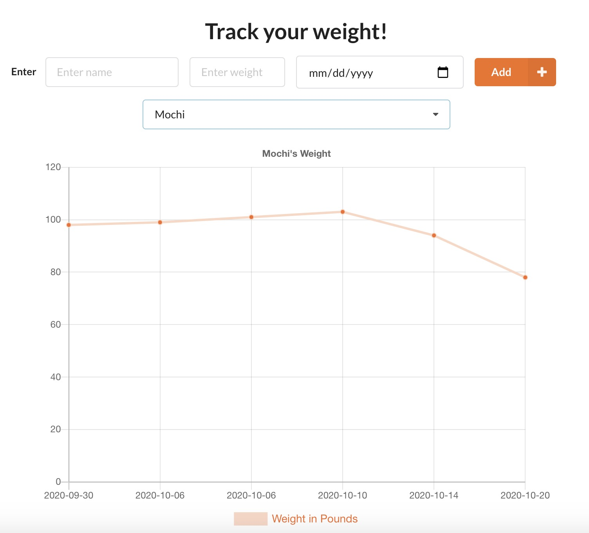
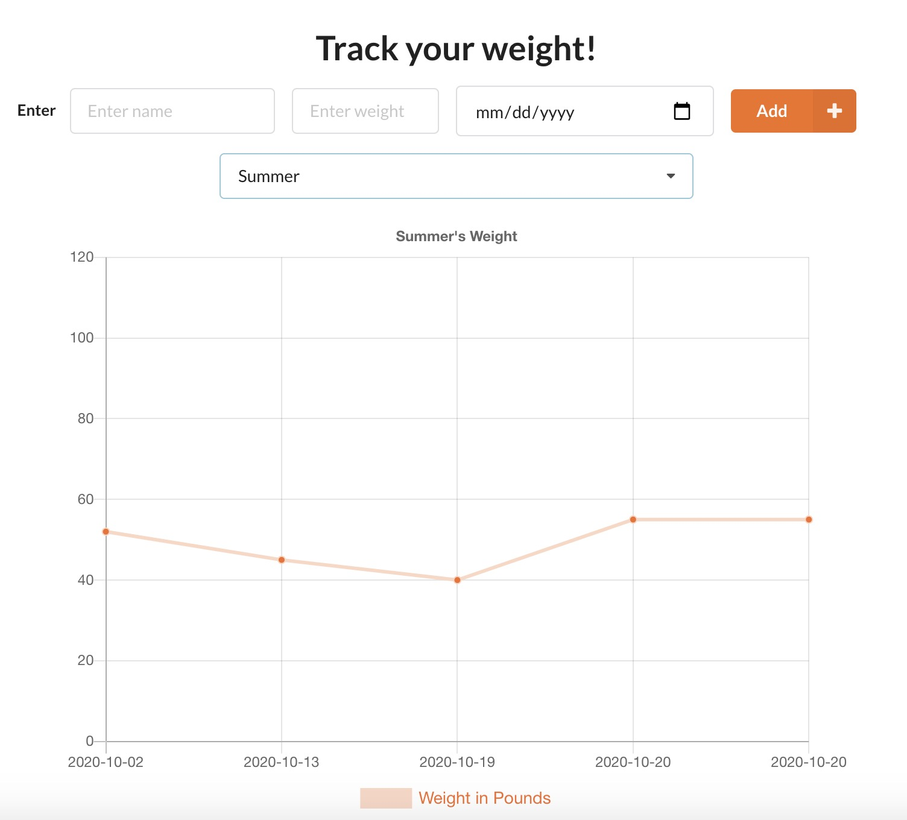
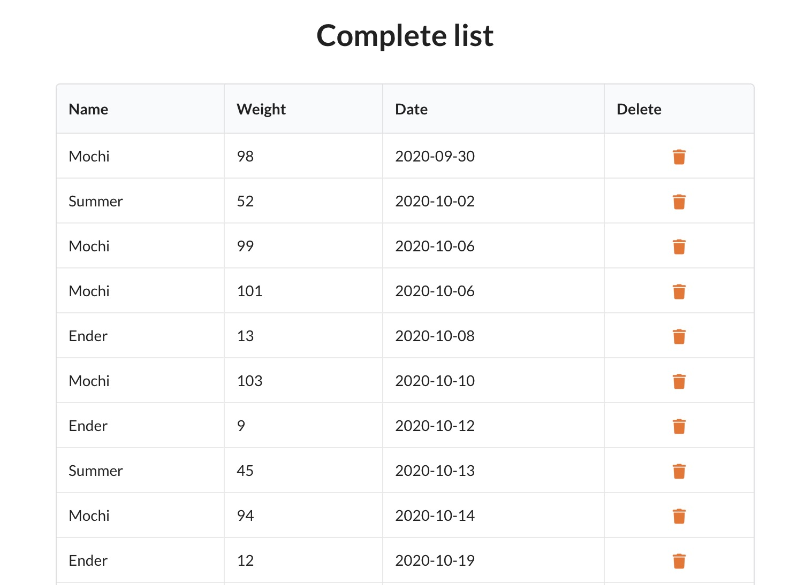

# Weight Tracker & Chart

This application allows multiple people (or pets) to track their weight at once and render their weight loss/gain/maintenance in a line graph.

## Technologies

This is a fullstack application built on the MERN stack (MongoDB, Express, React, Node.js) in addition to Chart.js for data visualization and Semantic UI as the CSS framework.

## Visuals

   
  
  

